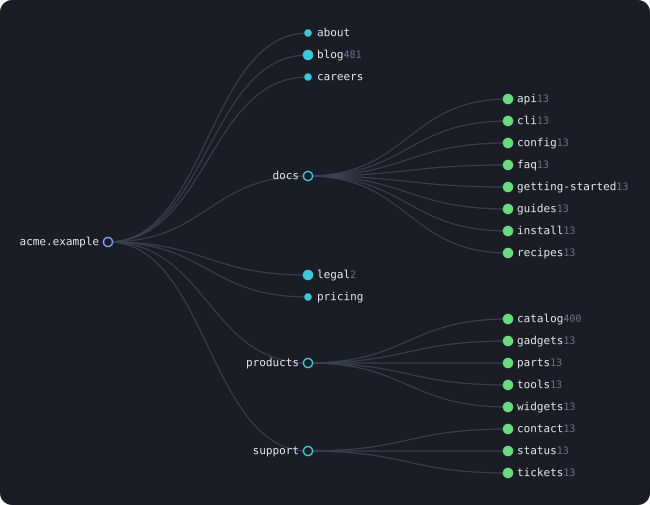

# sitemap-atlas

[](https://www.npmjs.com/package/sitemap-atlas)
[](https://github.com/Ilya-Avd/sitemap-atlas/actions/workflows/ci.yml)
[](LICENSE)
[](package.json)

Turn a `sitemap.xml` into a tree you can actually read — an interactive HTML page, a Mermaid
diagram, or a plain tree in your terminal.

Everything runs on your machine. No upload, no online service, no CDN: the HTML it writes is a
single self-contained file you can open straight from disk, mail to someone, or commit.

```
$ npx sitemap-atlas https://example.com
  found 1 sitemap: https://example.com/sitemap.xml

example.com  1,085
├── about
├── blog  481
│   ├── 2025  96
│   └── 2026  96
├── docs  105
│   ├── api  13
│   └── getting-started  13
└── products  453
    └── catalog  400
```

```
$ npx sitemap-atlas ./sitemap.xml -o report.html --open
```

The generated page gives you an outline view and a graph view over the same tree, instant
filtering, per-URL `lastmod` / `changefreq` / `priority`, and a light/dark toggle.

<p align="center">
  
</p>

## Install

```bash
npm install -g sitemap-atlas
```

Or run it without installing:

```bash
npx sitemap-atlas ./sitemap.xml
```

As a library:

```bash
npm install sitemap-atlas
```

Node 18.17 or newer, and **no dependencies** — the sitemap parser is part of the package.

## CLI

```
sitemap-atlas <file|url|-> [options]

Options
  -o, --out <file>       Write here. The extension picks the format.
  -f, --format <fmt>     html | text | mermaid | json | csv  (default: text, or from -o)
      --against <old>    Compare with an earlier sitemap and show what changed
      --lastmod          Also treat a changed <lastmod> as a change
      --fail-if-removed <n>  Exit 1 if more than n URLs (or n%) disappeared
      --open             Open the result in the default browser
      --depth <n>        Collapse everything below this depth (mermaid defaults to 4)
      --collapse         Merge single-child folder chains (2024/01/15)
      --sort <key>       name | count | lastmod          (default: name)
      --order <dir>      asc | desc
      --limit <n>        Stop after N URLs
      --no-follow        Do not descend into <sitemapindex> children
      --no-discover      Do not look up a site URL in robots.txt / common paths
      --offline          Never touch the network; resolve children to sibling files
      --timeout <ms>     Per-request timeout                (default: 20000)
      --user-agent <ua>  User-Agent for network reads
      --no-color         Plain text output
  -q, --quiet            Suppress progress on stderr
  -h, --help             Show this help
  -v, --version          Show the version
```

With no `-o` it prints the tree to stdout, so it composes:

```bash
sitemap-atlas ./sitemap.xml -f mermaid --depth 3 > structure.mmd
curl -s https://example.com/sitemap.xml | sitemap-atlas -
sitemap-atlas ./sitemap.xml -f json | jq '.stats'
```

### Comparing two sitemaps

`--against` takes the earlier sitemap; the input is the current one. Added URLs come out green,
removed ones struck through in red, and every folder carries a running `+N −M` so you can see where
a release landed without opening it.

```bash
sitemap-atlas https://example.com --against ./last-week.xml -o changes.html
```

```
shop.example  8
├── blog  2
│   ├── post-1
│   └── + post-2
├── - old-landing
└── products  3
    └── - discontinued
```

`--lastmod` also counts a moved `<lastmod>` as a change. It is off by default because many
generators rewrite that field on every build, which would mark the whole site as changed.

In CI, `--fail-if-removed` turns the comparison into a guard, so a deploy that quietly drops part
of the site fails the build instead of landing unnoticed:

```bash
sitemap-atlas https://example.com --against ./baseline.xml --fail-if-removed 5% -q
```

### A plain list of URLs works too

The tree only ever needed addresses; XML is just the usual container. A crawler export, a `find`
run or a pasted column of links goes through the same pipeline — blank lines and `#` comments are
ignored.

```bash
cat urls.txt | sitemap-atlas -
sitemap-atlas ./crawl-export.txt -o report.html
```

### What it handles

| | |
| --- | --- |
| A bare site address | `robots.txt` is checked first, then `/sitemap.xml`, `/sitemap_index.xml` and the other usual paths. Every sitemap robots.txt lists is merged. `--no-discover` turns this off. |
| `<sitemapindex>` | Followed automatically, up to 3 levels, 6 documents in parallel. `--no-follow` stops at the index. |
| `.xml.gz` | Detected by content, not by file name — gzipped responses without the header work too. |
| A downloaded index | Children are resolved to sibling files first, so a folder of sitemap parts works with `--offline`. |
| A broken child | Collected and reported; the rest of the site still renders. Only the root failing is fatal. |
| Namespaces | `xhtml:link` alternates, `image:image`, `video:video`, `news:news`, and prefixed roots. |

Output is deterministic: documents are read concurrently but assembled in the order the index
lists them.

The HTML stays small — around 100 bytes per URL plus a 25 KB viewer — because the page drops what
it can rebuild in the browser (paths, most `loc`s) and reduces hreflang alternates to a count.

## Library

```ts
import { loadSitemap, buildTree, summarize, renderHtml } from 'sitemap-atlas';

const sitemap = await loadSitemap('./sitemap.xml', { offline: true });
const tree = buildTree(sitemap.entries, { collapse: true, sortBy: 'count' });
const stats = summarize(tree);

console.log(`${stats.urls} URLs across ${stats.maxDepth} levels`);
await fs.writeFile('report.html', renderHtml(tree, stats, { source: './sitemap.xml' }));
```

### API

- `loadSitemap(input, options?)` — reads a URL, a file path, or a raw XML string, following nested
  indexes. Returns `{ entries, sources, refs, errors }`.
- `discover(siteUrl, read)` — the sitemaps a site advertises, via `robots.txt` then probing.
  Returns `{ found, skipped }`; `skipped` says which advertised sitemaps were left alone and why.
- `discoverSitemaps(siteUrl, read)` — the same, when only the locations matter.
- `parseRobots(text)` / `looksLikeSitemap(xml)` / `sameSite(origin, target)` — the pieces discovery
  is built from, exported because they are useful on their own.
- `parseSitemap(xml, source?)` — one document, synchronously. Returns `{ kind, entries, refs }`.
- `parseUrlList(text, source?)` / `looksLikeUrlList(text)` — the same, for a plain list of URLs.
- `buildTree(entries, options?)` — groups entries by host, then branches on path segments.
- `summarize(tree)` — URL and folder counts, depth, hosts, `lastmod` window, media counts.
- `diffSitemaps(before, after, options?)` — tags every URL `added`, `removed`, `changed` or
  `unchanged` and returns a summary. Removed URLs stay in the result so the tree can show them.
- `renderHtml(tree, stats, options?)` — one self-contained page. Pass `diff` to colour it.
- `renderText(tree, options?)` — the terminal tree, optionally with ANSI colour.
- `renderMermaid(tree, options?)` — Mermaid `graph` source.
- `renderCsv(tree, options?)` — one row per URL, for a spreadsheet.

Every option is documented on its type; `TreeNode` is a plain object, so you are free to walk it
yourself instead of using a renderer.

### Notes on the tree

- URLs are grouped by origin. More than one host produces a synthetic root above them.
- A trailing slash maps onto the folder node, so `/blog/` and `/blog/post` share a parent.
- Query strings stay attached to the last segment: `/search?q=a` and `/search?q=b` stay apart.
- A page listed twice is kept, not silently merged — counts stay honest and the viewer marks it.

## Development

```bash
npm install       # also generates src/render/assets.generated.ts
npm run dev       # rebuild on change
npm test
npm run lint
```

The HTML viewer lives in `src/viewer/` as ordinary `.css` and `.js`. `scripts/build-assets.mjs`
inlines both into a generated TypeScript module so the renderer stays dependency-free at runtime —
edit the viewer sources, never the generated file.

## VS Code extension

The same tree, inside the editor: open a `sitemap.xml` and hit the tree icon in the title bar.
See [vscode-extension/](vscode-extension/README.md).

## Contributing

See [CONTRIBUTING.md](CONTRIBUTING.md). Changes are recorded in [CHANGELOG.md](CHANGELOG.md).

## License

MIT — see [LICENSE](LICENSE).
